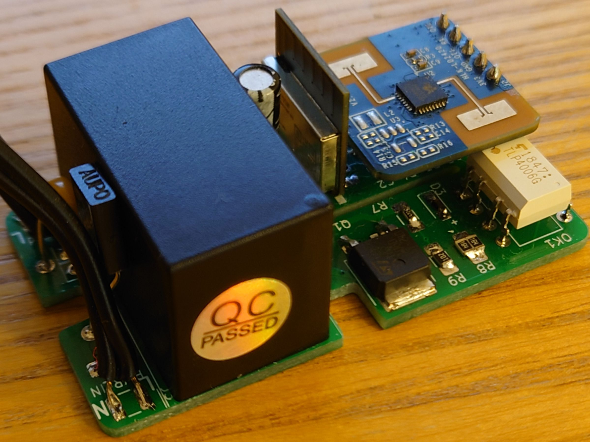
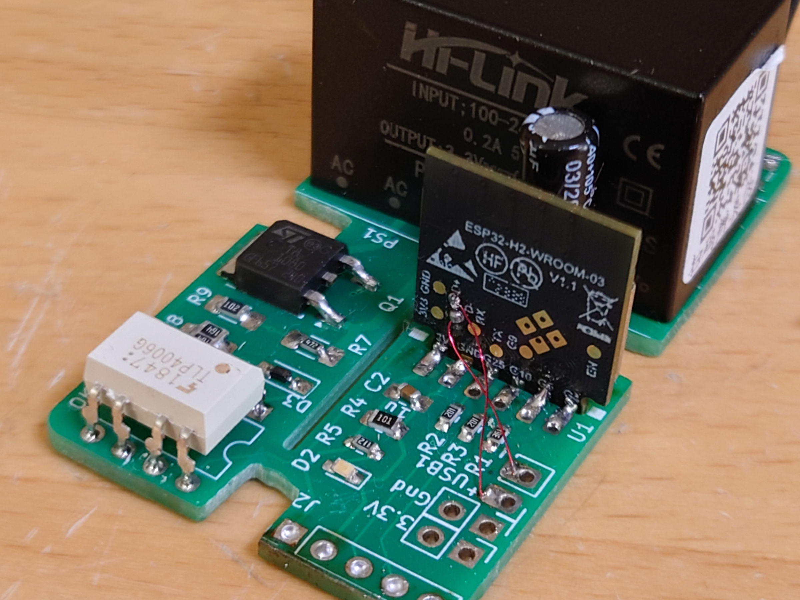
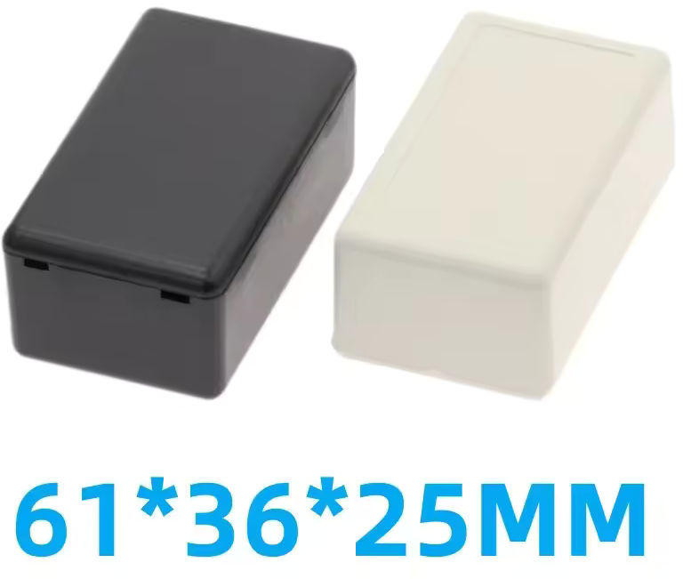
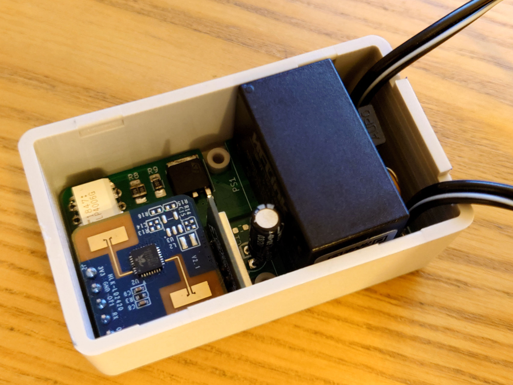
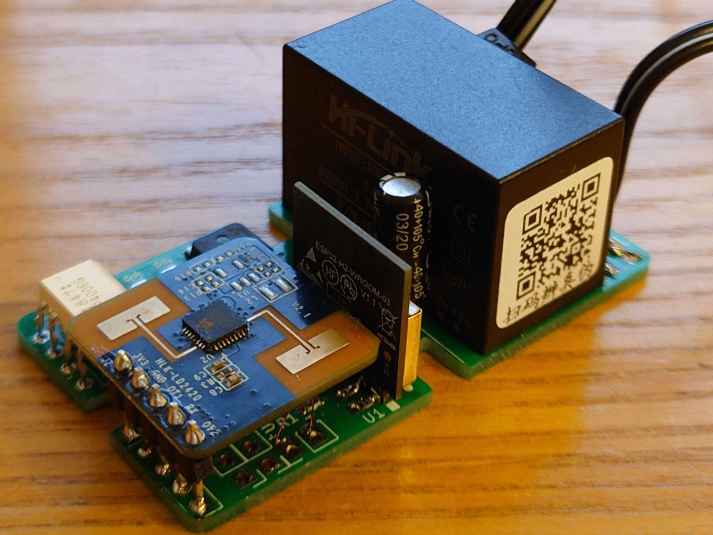
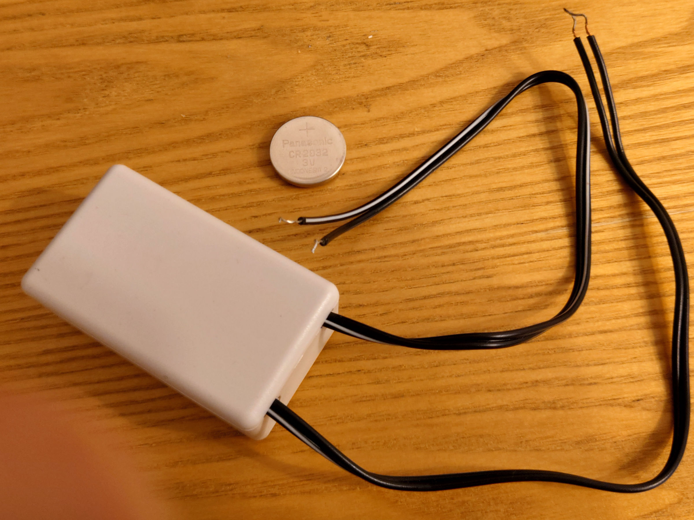
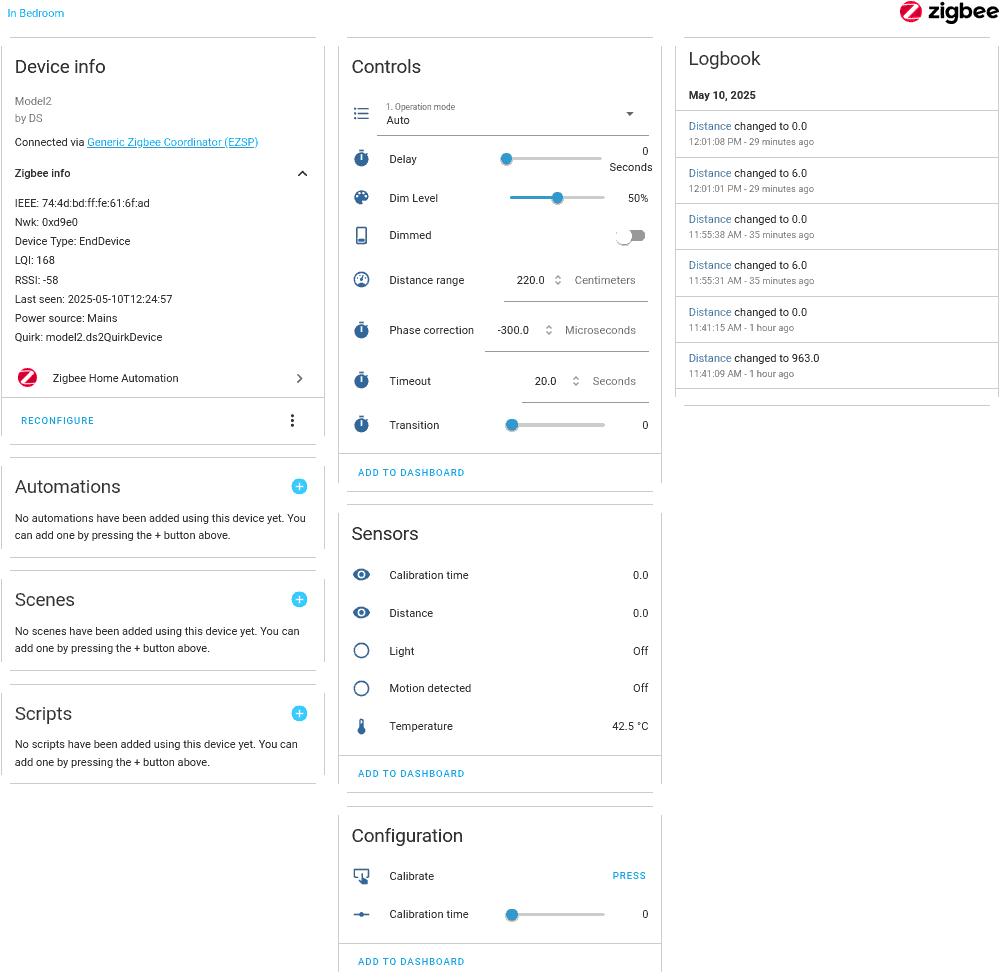

# esp32-zigbee-light-mini

Compact version of the remotely controlled indoor light based on ESP32-H2 and Home Assistant.

## Overview

This is a compact version of the [esp32-zigbee-light](https://github.com/David-EIPI/esp32-zigbee-light "Remotely controlled indoor light powered by ESP32-H2"), small enough to fit into an in-ceiling electrical box, enabling neat conversion of a standard ceiling fixture into a smart light.

This project utilizes a compact WROOM-03 module with an edge connector. The overall design follows [esp32-zigbee-light](https://github.com/David-EIPI/esp32-zigbee-light "Remotely controlled indoor light powered by ESP32-H2").

## Firmware

The firmware is written in C and built with `idf.py`. It implements a zero-crossing detector for TRIAC-based dimming and supports the **HLK-LD2420S** mmWave motion sensor with adjustable sensing distance. The firmware exposes 7 endpoints and 13 clusters:

* **6 Analog Output clusters** (configuration)
* **2 Analog Input clusters** (presence detection distance, calibration control)
* **2 Binary Input clusters** (motion state, light state)
* **1 Multistate Value cluster** (operation mode)
* **1 OnOff cluster** (dimming enable control)
* **1 Temperature cluster** (MCU internal temperature)

This design includes an additional temperature cluster due to the compact, enclosed setup. Monitoring internal temperature becomes important in this system.

### Sensor calibration

In this compact design, the LD2420s motion sensor has shown somewhat unstable output. Even without any motion, it occasionally "detects" activity at random distances. This likely results from EMI generated by the power supply, the microcontroller core, or the radio. Fortunately, the LD2420s sensor supports programmable signal thresholds, allowing for in-place calibration. The calibration approach and initial code are based on the [ESPHome LD2420 plugin](https://github.com/esphome/esphome/blob/dev/esphome/components/ld2420 "ESPHome LD2420 plugin").

Calibration is initiated by writing a numerical value (interpreted as calibration duration in seconds) to the Analog Input cluster at Endpoint 2. A ZHA quirk can provide a button to conveniently start calibration.

## Hardware

Schematics and PCB layout were created using KiCad. The board integrates an AC-DC power supply, ESP32-H2 controller, LD2420s sensor, TRIAC, and associated control circuitry. Input protection includes a current fuse, thermal fuse, and a TVS diode. The TRIAC control circuit matches the one in [esp32-zigbee-light](https://github.com/David-EIPI/esp32-zigbee-light "Remotely controlled indoor light powered by ESP32-H2").

### Power supply

The largest component on the board is the AC-DC converter.

This is the HLK-2M03 from HiLink, an isolated 3.3 V, 600 mA converter.  Measured ESP32 consumption is approximately 20 mA during RF transmission, and the documented LD2420s consumption averages around 50 mA, with occasional peaks of about 70 mA. Including the optocoupler current, total demand should not exceed 100 mA. HLK-2M03 is somewhat oversized for this design but smaller modules appear unavailable.

### ESP32-H2 Wroom-03 module

The module is designed for vertical mounting to conserve PCB space. Its height above the board is 16 mm, which is lower than the AC-DC module, thus not affecting the overall dimensions.

Soldering this module presented some challenges:

First, the slot recommended by the datasheet is excessively wide, causing the module to fit loosely and leaving large air gaps difficult to bridge with solder. To resolve this, I soldered short wire segments to the pads as guides, but the result still looks ugly. I wonder if wave soldering would work for this module.

Second, programming is performed via small test pads (USB or serial port). In the datasheet I did not find any recommendations regarding manufacturer-supported programming fixtures. While some users create custom 3D-printed jigs, I opted to solder free-hanging wires directly to the module’s USB pads, enabling programming and debugging after board assembly.

### Enclosure

The PCB was designed to fit one of the many enclosures sold on AliExpress. Many sellers offer identical boxes; I purchased this one below:

The assembled board fits almost perfectly, though slight filing was necessary on the cutouts made for the mounting posts. The inner height of the enclosure just accommodates the AC-DC converter, leaving insufficient room to place the board on top of the mounting posts. Instead, I made small cutouts around the posts, allowing the board to sit flat at the bottom.

To ensure proper fit, the board's bottom side needed to remain completely flat. The AC-DC converter’s leads were trimmed flush, and minimal solder was used to avoid bulges. All other through-hole components were soldered from the top side while pressing the board firmly onto a flat surface, which is why they “hover” above the board surface.

The enclosure features convenient side-wall cutouts for wiring; however, matching cutouts on the lid’s inner rim were missing and had to be manually added. Below is the final assembled enclosure, shown alongside a CR2032 battery for scale reference:

## ZHA Quirk

The ZHA quirk supporting this device is essentially identical to that in the [esp32-zigbee-light](https://github.com/David-EIPI/esp32-zigbee-light "Remotely controlled indoor light powered by ESP32-H2") project, with only minor additions required to enable sensor calibration requests. This functionality can be implemented in two ways:

* Using the `.number()` method, which defaults to a CONFIG entity displayed as a slider. Setting this slider triggers calibration for the selected duration.
* Using the `.write_attr_butt()` method, creating a button that sets a predefined attribute value upon pressing.

I have left both methods are in the quirk file for reference.

